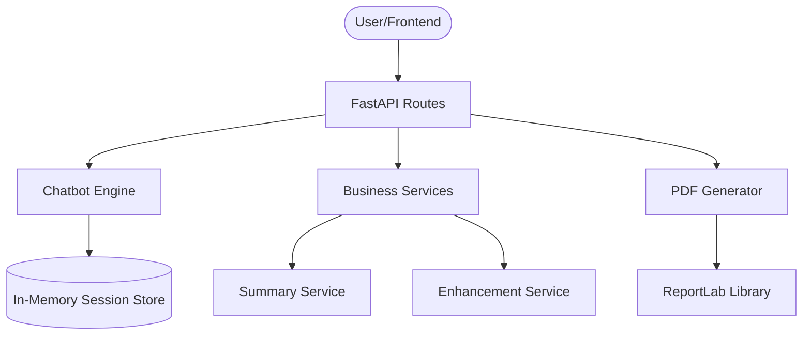
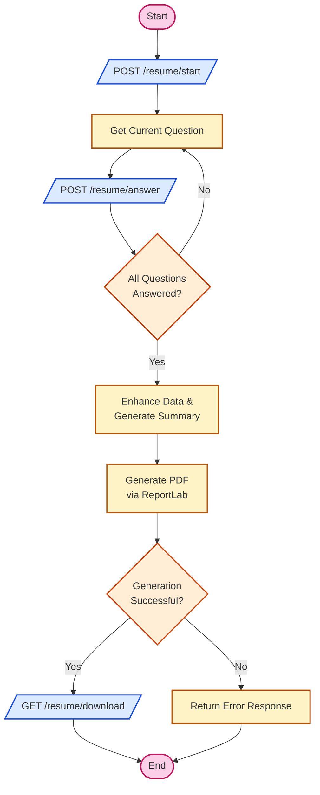

# AI Resume Builder - Backend

A powerful, FastAPI-based backend service designed to generate professional resumes through an interactive chatbot interface. This system uses a rule-based engine to collect user information and generates high-quality PDF resumes using ReportLab.

## 🚀 Features

- **Interactive Chatbot Engine**: A structured, rule-based flow to collect personal details, experience, skills, and projects.
- **Dynamic PDF Generation**: Utilizes `ReportLab` to create professional, well-formatted resumes.
- **Data Enhancement**: Built-in services to refine project descriptions and generate professional summaries.
- **RESTful API**: Clean endpoints for session management, answering questions, and triggering PDF generation.
- **CORS Support**: Ready to integrate with modern frontend frameworks like Next.js.

## 🛠️ Tech Stack

- **Framework**: [FastAPI](https://fastapi.tiangolo.com/)
- **PDF Generation**: [ReportLab](https://www.reportlab.com/)
- **Data Validation**: [Pydantic](https://docs.pydantic.dev/)
- **Server**: [Uvicorn](https://www.uvicorn.org/)
- **Environment Management**: `python-dotenv`

## 📋 Prerequisites

- Python 3.9+
- `pip` (Python package manager)

## ⚙️ Setup & Installation

1. **Clone the repository**:

   ```bash
   git clone <repository-url>
   cd AI_RESUME_GENERATOR_BACKEND
   ```

2. **Create a virtual environment**:

   ```bash
   python -m venv venv
   # On Windows:
   venv\Scripts\activate
   # On macOS/Linux:
   source venv/bin/activate
   ```

3. **Install dependencies**:

   ```bash
   pip install -r requirements.txt
   ```

4. **Configure Environment Variables**:
   Create a `.env` file based on `.env.example`:

   ```env
   PORT=8000
   HOST=0.0.0.0
   CORS_ORIGINS=http://localhost:3000
   ```

5. **Run the application**:
   ```bash
   python app/main.py
   # or
   uvicorn app.main:app --reload
   ```

## 📡 API Endpoints

| Method | Endpoint                  | Description                                      |
| ------ | ------------------------- | ------------------------------------------------ |
| `POST` | `/resume/start`           | Initialize a new resume building session.        |
| `GET`  | `/resume/question`        | Get the current question for a session.          |
| `POST` | `/resume/answer`          | Submit an answer to the current question.        |
| `POST` | `/resume/generate`        | Trigger PDF generation for a completed session.  |
| `GET`  | `/resume/download`        | Download the generated PDF resume.               |
| `POST` | `/resume/direct-generate` | Generate a PDF directly from provided JSON data. |

## 🏗️ Architecture

The backend is built with a modular architecture, separating concerns between API handling, session management, and document generation.



## 🔄 Workflow

The following flowchart illustrates the logical sequence of the resume building process, from initialization to the final PDF generation.


### Logical Flow (Mermaid)



## 📄 Generated PDF Documentation

If you are unable to download the PDF files directly from the links provided by the assistant, you can find them in your local project directory:

- **Backend PDF**: `c:\Users\samee\OneDrive\Desktop\AI_RESUME_GENERATOR_BACKEND\README.pdf`
- **Frontend PDF**: `c:\Users\samee\OneDrive\Desktop\AI_RESUME_GENERATOR_FRONTEND\README.pdf`

To open them, simply navigate to the folders in your File Explorer and double-click the files.

## 📂 Project Structure

```text
app/
├── chatbot/       # Rule-based logic and session management
├── models/        # Pydantic schemas for data validation
├── pdf/           # ReportLab PDF generation templates
├── routes/        # API route definitions
├── services/      # Data enhancement and summary generation
├── utils/         # Helper functions
└── main.py        # Application entry point
```

## 👨‍💻 Developed By

- **SAMEER**

* [GitHub](https://github.com/Yashwant-Rangrej)
* [LinkedIn](https://www.linkedin.com/in/yashwant-rangrej-0856993a8/)
