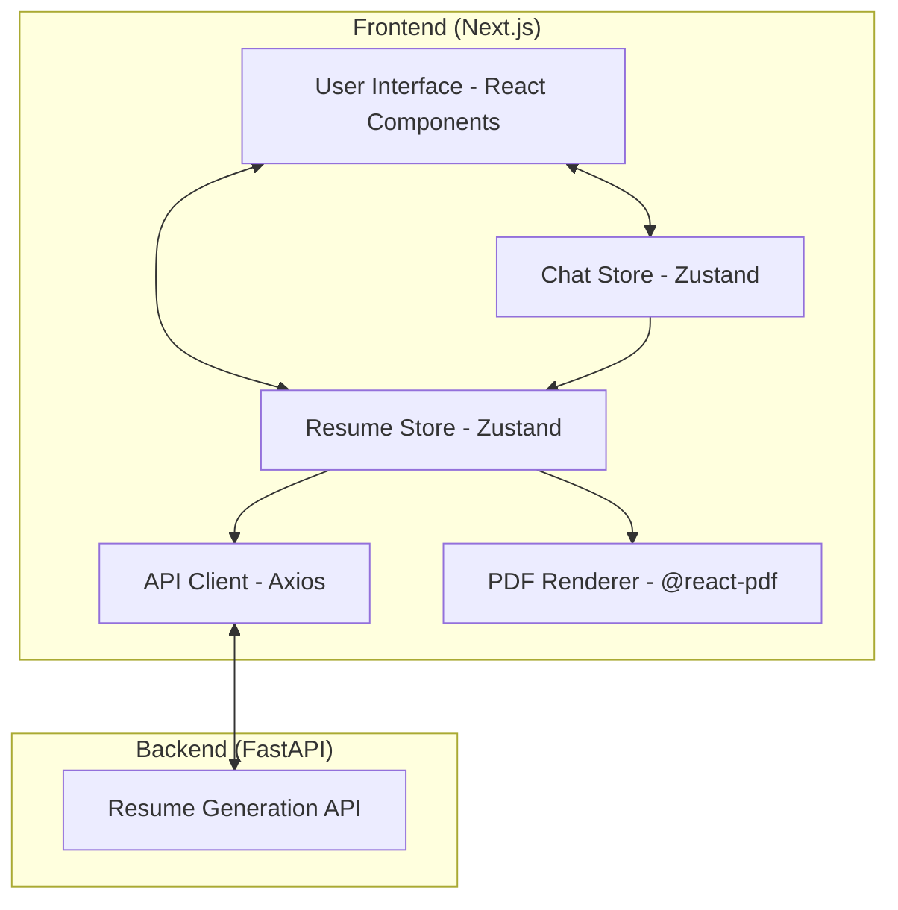
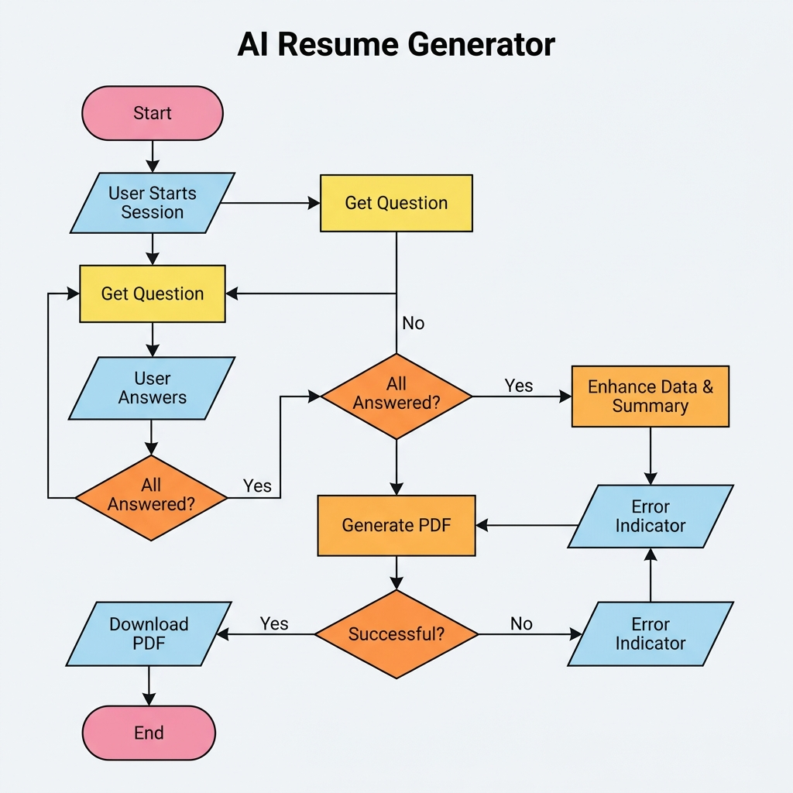
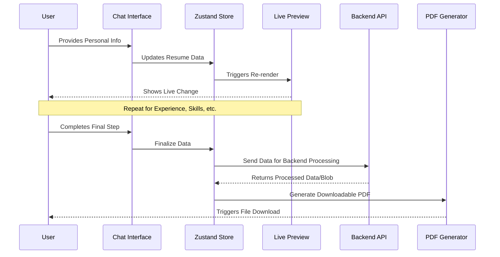

# AI Resume Builder - Frontend

A modern, interactive web application built with Next.js that guides users through creating professional resumes using an AI-powered (or rule-based) chatbot interface.

## 🚀 Features

- **Conversational UI**: A sleek, step-by-step chatbot interface to collect user information.
- **Progress Tracking**: Real-time progress bar to show how much of the resume is completed.
- **Dynamic Preview**: See your information being formatted as you provide it.
- **Instant PDF Download**: One-click generation and download of professional PDF resumes.
- **Responsive Design**: Optimized for both desktop and mobile devices.
- **Smooth Animations**: Powered by Framer Motion for a premium user experience.

## 🛠️ Tech Stack

- **Framework**: [Next.js 15](https://nextjs.org/) (App Router)
- **Styling**: [Tailwind CSS 4](https://tailwindcss.com/)
- **UI Components**: [Radix UI](https://www.radix-ui.com/) & [Lucide Icons](https://lucide.dev/)
- **Animations**: [Framer Motion](https://www.framer.com/motion/)
- **State Management**: [Zustand](https://github.com/pmndrs/zustand)
- **API Client**: [Axios](https://axios-http.com/)
- **PDF Rendering**: [@react-pdf/renderer](https://react-pdf.org/)

## 📋 Prerequisites

- Node.js 18+
- npm / yarn / pnpm

## ⚙️ Setup & Installation

1. **Clone the repository**:

   ```bash
   git clone <repository-url>
   cd AI_RESUME_GENERATOR_FRONTEND
   ```

2. **Install dependencies**:

   ```bash
   npm install
   ```

3. **Configure Environment Variables**:
   Create a `.env.local` file in the root directory:

   ```env
   NEXT_PUBLIC_API_URL=http://localhost:8000
   ```

4. **Run the development server**:

   ```bash
   npm run dev
   ```

5. **Build for production**:
   ```bash
   npm run build
   npm run start
   ```

## 🏗️ Project Structure

```text
src/
├── app/            # Next.js App Router (pages and layouts)
│   ├── builder/    # Main resume builder interface
│   └── resume/     # Resume view/management
├── components/     # UI components
│   ├── chatbot/    # Chat interface components
│   ├── pdf/        # PDF generation components
│   ├── preview/    # Real-time resume preview
│   └── ui/         # Base shadcn/ui components
├── services/       # API communication (Axios)
├── store/          # Global state (Zustand)
├── types/          # TypeScript definitions
└── utils/          # Helper functions
```

## 📐 Architecture

The application follows a modern decoupled architecture with a centralized state management system.



## 🔄 Application Flow

The following flowchart illustrates the user journey and data flow within the application.



### Sequential Flow (Mermaid)



## 📄 Generated PDF Documentation

If you are unable to download the PDF files directly from the links provided by the assistant, you can find them in your local project directory:

- **Frontend PDF**: `c:\Users\samee\OneDrive\Desktop\AI_RESUME_GENERATOR_FRONTEND\README.pdf`
- **Backend PDF**: `c:\Users\samee\OneDrive\Desktop\AI_RESUME_GENERATOR_BACKEND\README.pdf`

To open them, simply navigate to the folders in your File Explorer and double-click the files.

## 🌐 Integration

This frontend is designed to work seamlessly with the [AI Resume Builder Backend](https://github.com/Yashwant-Rangrej/AI_RESUME_GENERATOR_BACKEND). Ensure the backend is running and the `NEXT_PUBLIC_API_URL` is correctly configured.

## 👨‍💻 Developed By

**SAMEER**

- [GitHub](https://github.com/Yashwant-Rangrej)
- [LinkedIn](https://www.linkedin.com/in/yashwant-rangrej-0856993a8/)
